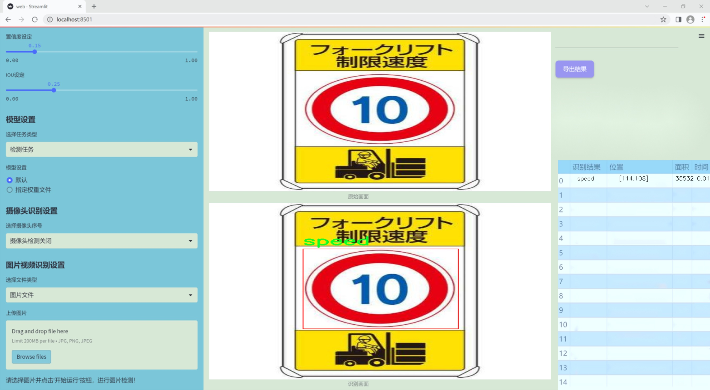
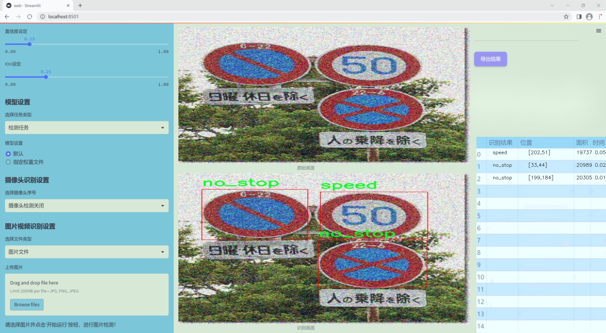
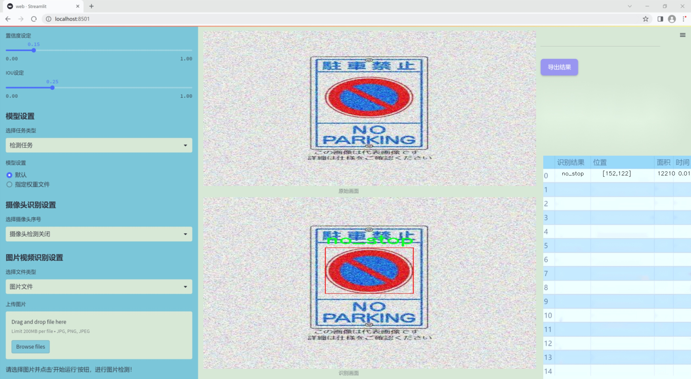
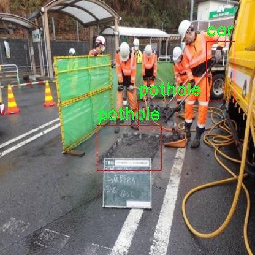
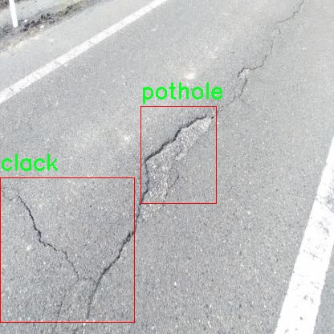
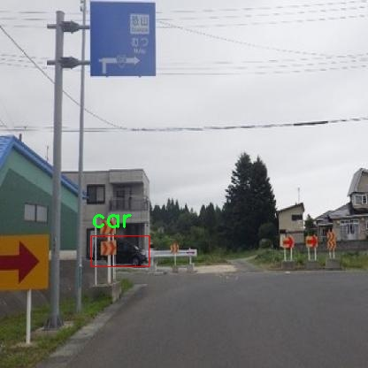
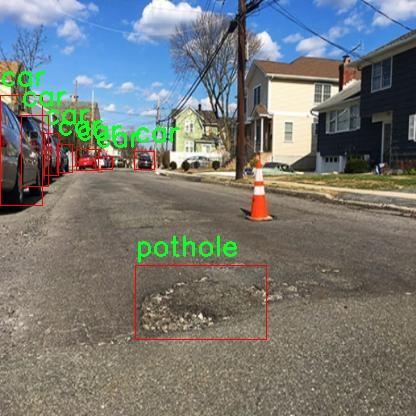
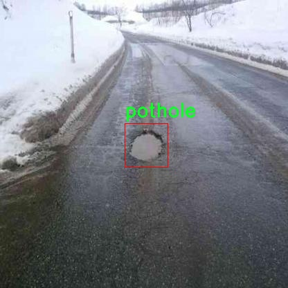

# 改进yolo11-DLKA等200+全套创新点大全：路面坑洼检测系统源码＆数据集全套

### 1.图片效果展示







##### 项目来源 **[人工智能促进会 2024.10.24](https://kdocs.cn/l/cszuIiCKVNis)**

注意：由于项目一直在更新迭代，上面“1.图片效果展示”和“2.视频效果展示”展示的系统图片或者视频可能为老版本，新版本在老版本的基础上升级如下：（实际效果以升级的新版本为准）

  （1）适配了YOLOV11的“目标检测”模型和“实例分割”模型，通过加载相应的权重（.pt）文件即可自适应加载模型。

  （2）支持“图片识别”、“视频识别”、“摄像头实时识别”三种识别模式。

  （3）支持“图片识别”、“视频识别”、“摄像头实时识别”三种识别结果保存导出，解决手动导出（容易卡顿出现爆内存）存在的问题，识别完自动保存结果并导出到tempDir中。

  （4）支持Web前端系统中的标题、背景图等自定义修改。

  另外本项目提供训练的数据集和训练教程,暂不提供权重文件（best.pt）,需要您按照教程进行训练后实现图片演示和Web前端界面演示的效果。

### 2.视频效果展示

[2.1 视频效果展示](https://www.bilibili.com/video/BV1tY1YYbEFZ/)

### 3.背景

研究背景与意义

随着城市化进程的加快，路面交通设施的维护与管理变得愈发重要。路面坑洼不仅影响行车安全，还可能导致交通事故的发生，给社会带来巨大的经济损失。因此，及时、准确地检测和修复路面坑洼成为了交通管理部门亟待解决的问题。传统的人工巡查方法不仅效率低下，而且容易受到主观因素的影响，难以保证检测的准确性和全面性。近年来，计算机视觉技术的迅猛发展为路面坑洼检测提供了新的解决方案。

在众多计算机视觉算法中，YOLO（You Only Look Once）系列因其高效的实时检测能力而受到广泛关注。YOLOv11作为该系列的最新版本，结合了深度学习的优势，能够在复杂的环境中快速识别和定位目标。然而，现有的YOLOv11模型在特定场景下的表现仍有提升空间，尤其是在针对路面坑洼等小目标的检测上。因此，基于改进YOLOv11的路面坑洼检测系统的研究具有重要的现实意义。

本研究将利用“Detection5”数据集，该数据集包含818幅图像，涵盖了多种交通相关类别，包括“car”、“clack”、“no_stop”、“pothole”和“speed”。通过对这些图像的深入分析与处理，改进YOLOv11模型的特征提取和目标检测能力，旨在提高路面坑洼的检测精度和速度。此外，本研究还将探索如何将改进后的模型应用于实际的路面监测系统中，为城市交通管理提供有效的技术支持，最终实现智能化的路面维护与管理。通过这一研究，不仅能够提升路面坑洼检测的效率和准确性，还将为未来的智能交通系统建设奠定基础，推动交通管理的数字化转型。

### 4.数据集信息展示

##### 4.1 本项目数据集详细数据（类别数＆类别名）

nc: 5
names: ['car', 'clack', 'no_stop', 'pothole', 'speed']


该项目为【目标检测】数据集，请在【训练教程和Web端加载模型教程（第三步）】这一步的时候按照【目标检测】部分的教程来训练

##### 4.2 本项目数据集信息介绍

本项目数据集信息介绍

本项目所使用的数据集名为“Detection5”，其主要目的是为了训练和改进YOLOv11模型，以实现高效的路面坑洼检测系统。该数据集包含五个类别，分别为“car”（汽车）、“clack”（车轮碰撞声）、“no_stop”（不停车标志）、“pothole”（坑洼）和“speed”（速度限制标志）。这些类别的选择旨在全面覆盖与路面状况相关的关键元素，从而提高模型在实际应用中的准确性和鲁棒性。

在数据集的构建过程中，采用了多种数据采集技术，包括实地拍摄和合成数据生成，以确保数据的多样性和代表性。每个类别的样本均经过精心标注，确保模型能够准确识别不同的路面状况和交通标志。例如，汽车类别的样本涵盖了不同品牌、颜色和形状的车辆，以模拟真实世界中的复杂交通环境；而坑洼类别则专注于不同类型和大小的路面缺陷，以提高模型对各种坑洼的检测能力。

此外，数据集还考虑了不同天气和光照条件下的样本，以增强模型的适应性。通过引入多样化的场景，模型能够在各种环境中保持良好的性能，减少因环境变化导致的误检和漏检现象。这一数据集的构建不仅为YOLOv11模型的训练提供了坚实的基础，也为后续的路面监测和维护工作提供了重要的数据支持。通过不断优化和扩展“Detection5”数据集，我们期望能够推动智能交通系统的发展，提高城市道路的安全性和通行效率。











### 5.全套项目环境部署视频教程（零基础手把手教学）

[5.1 所需软件PyCharm和Anaconda安装教程（第一步）](https://www.bilibili.com/video/BV1BoC1YCEKi/?spm_id_from=333.999.0.0&vd_source=bc9aec86d164b67a7004b996143742dc)


[5.2 安装Python虚拟环境创建和依赖库安装视频教程（第二步）](https://www.bilibili.com/video/BV1ZoC1YCEBw?spm_id_from=333.788.videopod.sections&vd_source=bc9aec86d164b67a7004b996143742dc)

### 6.改进YOLOv11训练教程和Web_UI前端加载模型教程（零基础手把手教学）

[6.1 改进YOLOv11训练教程和Web_UI前端加载模型教程（第三步）](https://www.bilibili.com/video/BV1BoC1YCEhR?spm_id_from=333.788.videopod.sections&vd_source=bc9aec86d164b67a7004b996143742dc)


按照上面的训练视频教程链接加载项目提供的数据集，运行train.py即可开始训练



     Epoch   gpu_mem       box       obj       cls    labels  img_size
     1/200     20.8G   0.01576   0.01955  0.007536        22      1280: 100%|██████████| 849/849 [14:42<00:00,  1.04s/it]
               Class     Images     Labels          P          R     mAP@.5 mAP@.5:.95: 100%|██████████| 213/213 [01:14<00:00,  2.87it/s]
                 all       3395      17314      0.994      0.957      0.0957      0.0843

     Epoch   gpu_mem       box       obj       cls    labels  img_size
     2/200     20.8G   0.01578   0.01923  0.007006        22      1280: 100%|██████████| 849/849 [14:44<00:00,  1.04s/it]
               Class     Images     Labels          P          R     mAP@.5 mAP@.5:.95: 100%|██████████| 213/213 [01:12<00:00,  2.95it/s]
                 all       3395      17314      0.996      0.956      0.0957      0.0845

     Epoch   gpu_mem       box       obj       cls    labels  img_size
     3/200     20.8G   0.01561    0.0191  0.006895        27      1280: 100%|██████████| 849/849 [10:56<00:00,  1.29it/s]
               Class     Images     Labels          P          R     mAP@.5 mAP@.5:.95: 100%|███████   | 187/213 [00:52<00:00,  4.04it/s]
                 all       3395      17314      0.996      0.957      0.0957      0.0845


###### [项目数据集下载链接](https://kdocs.cn/l/cszuIiCKVNis)

### 7.原始YOLOv11算法讲解


##### YOLOv11三大损失函数

YOLOv11（You Only Look Once）是一种流行的目标检测算法，其损失函数设计用于同时优化分类和定位任务。YOLO的损失函数通常包括几个部分：
**分类损失、定位损失（边界框回归损失）和置信度损失** 。其中，

  1. box_loss（边界框回归损失）是用于优化预测边界框与真实边界框之间的差异的部分。

  2. cls_loss（分类损失）是用于优化模型对目标类别的预测准确性的部分。分类损失确保模型能够正确地识别出图像中的对象属于哪个类别。

  3. dfl_loss（Distribution Focal Loss）是YOLO系列中的一种损失函数，特别是在一些改进版本如YOLOv5和YOLOv7中被引入。它的主要目的是解决目标检测中的类别不平衡问题，并提高模型在处理小目标和困难样本时的性能。

##### 边界框回归损失详解

box_loss（边界框回归损失）是用于优化预测边界框与真实边界框之间的差异的部分。


##### box_loss 的具体意义


##### 为什么需要 box_loss

  * 精确定位：通过最小化中心点坐标损失和宽高损失，模型能够更准确地预测目标的位置和大小。
  * 平衡不同类型的目标：使用平方根来处理宽高损失，可以更好地平衡不同大小的目标，确保小目标也能得到足够的关注。
  * 稳定训练：适当的损失函数设计有助于模型的稳定训练，避免梯度爆炸或消失等问题。

##### 分类损失详解

在YOLO（You Only Look
Once）目标检测算法中，cls_loss（分类损失）是用于优化模型对目标类别的预测准确性的部分。分类损失确保模型能够正确地识别出图像中的对象属于哪个类别。下面是关于cls_loss的详细解读：

##### 分类损失 (cls_loss) 的具体意义

  
分类损失通常使用交叉熵损失（Cross-Entropy
Loss）来计算。交叉熵损失衡量的是模型预测的概率分布与真实标签之间的差异。在YOLO中，分类损失的具体形式如下：


##### 为什么需要 cls_loss

  * 类别识别：cls_loss 确保模型能够正确识别出图像中的目标属于哪个类别。这对于目标检测任务至关重要，因为不仅需要知道目标的位置，还需要知道目标的类型。

  * 多类别支持：通过最小化分类损失，模型可以处理多个类别的目标检测任务。例如，在道路缺陷检测中，可能需要识别裂缝、坑洞、路面破损等多种类型的缺陷。

  * 提高准确性：分类损失有助于提高模型的分类准确性，从而提升整体检测性能。通过优化分类损失，模型可以更好地学习不同类别之间的特征差异。

##### 分布损失详解

`dfl_loss`（Distribution Focal
Loss）是YOLO系列中的一种损失函数，特别是在一些改进版本如YOLOv5和YOLOv7中被引入。它的主要目的是解决目标检测中的类别不平衡问题，并提高模型在处理小目标和困难样本时的性能。下面是对`dfl_loss`的详细解读：

##### DFL Loss 的背景

在目标检测任务中，类别不平衡是一个常见的问题。某些类别的样本数量可能远远多于其他类别，这会导致模型在训练过程中对常见类别的学习效果较好，而对罕见类别的学习效果较差。此外，小目标和困难样本的检测也是一个挑战，因为这些目标通常具有较少的特征信息，容易被忽略或误分类。

为了应对这些问题，研究者们提出了多种改进方法，其中之一就是`dfl_loss`。`dfl_loss`通过引入分布焦点损失来增强模型对困难样本的关注，并改善类别不平衡问题。

##### DFL Loss 的定义

DFL Loss
通常与传统的交叉熵损失结合使用，以增强模型对困难样本的学习能力。其核心思想是通过对每个类别的预测概率进行加权，使得模型更加关注那些难以正确分类的样本。

DFL Loss 的公式可以表示为：


##### DFL Loss 的具体意义**

  * **类别不平衡：** 通过引入平衡因子 α，DFL Loss 可以更好地处理类别不平衡问题。对于少数类别的样本，可以通过增加其权重来提升其重要性，从而提高模型对这些类别的检测性能。
  *  **困难样本：** 通过聚焦参数 γ，DFL Loss 可以让模型更加关注那些难以正确分类的样本。当 
  * γ 较大时，模型会对那些预测概率较低的样本给予更多的关注，从而提高这些样本的分类准确性。
  *  **提高整体性能** ：DFL Loss 结合了传统交叉熵损失的优势，并通过加权机制增强了模型对困难样本的学习能力，从而提高了整体的检测性能。


### 8.200+种全套改进YOLOV11创新点原理讲解

#### 8.1 200+种全套改进YOLOV11创新点原理讲解大全

由于篇幅限制，每个创新点的具体原理讲解就不全部展开，具体见下列网址中的改进模块对应项目的技术原理博客网址【Blog】（创新点均为模块化搭建，原理适配YOLOv5~YOLOv11等各种版本）

[改进模块技术原理博客【Blog】网址链接](https://gitee.com/qunmasj/good)


#### 8.2 精选部分改进YOLOV11创新点原理讲解

###### 这里节选部分改进创新点展开原理讲解(完整的改进原理见上图和[改进模块技术原理博客链接](https://gitee.com/qunmasj/good)【如果此小节的图加载失败可以通过CSDN或者Github搜索该博客的标题访问原始博客，原始博客图片显示正常】
### RepViT简介

近年来，与轻量级卷积神经网络(cnn)相比，轻量级视觉变压器(ViTs)在资源受限的移动设备上表现出了更高的性能和更低的延迟。这种改进通常归功于多头自注意模块，它使模型能够学习全局表示。然而，轻量级vit和轻量级cnn之间的架构差异还没有得到充分的研究。在这项研究中，我们重新审视了轻量级cnn的高效设计，并强调了它们在移动设备上的潜力。通过集成轻量级vit的高效架构选择，我们逐步增强了标准轻量级CNN的移动友好性，特别是MobileNetV3。这就产生了一个新的纯轻量级cnn家族，即RepViT。大量的实验表明，RepViT优于现有的轻型vit，并在各种视觉任务中表现出良好的延迟。在ImageNet上，RepViT在iPhone 12上以近1ms的延迟实现了超过80%的top-1精度，据我们所知，这是轻量级模型的第一次。

#### RepViT简介
轻量级模型研究一直是计算机视觉任务中的一个焦点，其目标是在降低计算成本的同时达到优秀的性能。轻量级模型与资源受限的移动设备尤其相关，使得视觉模型的边缘部署成为可能。在过去十年中，研究人员主要关注轻量级卷积神经网络（CNNs）的设计，提出了许多高效的设计原则，包括可分离卷积 、逆瓶颈结构 、通道打乱 和结构重参数化等，产生了 MobileNets ，ShuffleNets和 RepVGG 等代表性模型。

另一方面，视觉 Transformers（ViTs）成为学习视觉表征的另一种高效方案。与 CNNs 相比，ViTs 在各种计算机视觉任务中表现出了更优越的性能。然而，ViT 模型一般尺寸很大，延迟很高，不适合资源受限的移动设备。因此，研究人员开始探索 ViT 的轻量级设计。许多高效的ViTs设计原则被提出，大大提高了移动设备上 ViTs 的计算效率，产生了EfficientFormers ，MobileViTs等代表性模型。这些轻量级 ViTs 在移动设备上展现出了相比 CNNs 的更强的性能和更低的延迟。

轻量级 ViTs 优于轻量级 CNNs 的原因通常归结于多头注意力模块，该模块使模型能够学习全局表征。然而，轻量级 ViTs 和轻量级 CNNs 在块结构、宏观和微观架构设计方面存在值得注意的差异，但这些差异尚未得到充分研究。这自然引出了一个问题：轻量级 ViTs 的架构选择能否提高轻量级 CNN 的性能？在这项工作中，我们结合轻量级 ViTs 的架构选择，重新审视了轻量级 CNNs 的设计。我们的旨在缩小轻量级 CNNs 与轻量级 ViTs 之间的差距，并强调前者与后者相比在移动设备上的应用潜力。


在 ConvNeXt 中，参考该博客提出的基于 ResNet50 架构的基础上通过严谨的理论和实验分析，最终设计出一个非常优异的足以媲美 Swin-Transformer 的纯卷积神经网络架构。同样地，RepViT也是主要通过将轻量级 ViTs 的架构设计逐步整合到标准轻量级 CNN，即MobileNetV3-L，来对其进行针对性地改造（魔改）。在这个过程中，作者们考虑了不同粒度级别的设计元素，并通过一系列步骤达到优化的目标。


详细优化步骤如下：

#### 训练配方的对齐
论文中引入了一种衡量移动设备上延迟的指标，并将训练策略与现有的轻量级 ViTs 对齐。这一步骤主要是为了确保模型训练的一致性，其涉及两个概念，即延迟度量和训练策略的调整。

#### 延迟度量指标
为了更准确地衡量模型在真实移动设备上的性能，作者选择了直接测量模型在设备上的实际延迟，以此作为基准度量。这个度量方法不同于之前的研究，它们主要通过FLOPs或模型大小等指标优化模型的推理速度，这些指标并不总能很好地反映在移动应用中的实际延迟。

#### 训练策略的对齐
这里，将 MobileNetV3-L 的训练策略调整以与其他轻量级 ViTs 模型对齐。这包括使用 AdamW 优化器-ViTs 模型必备的优化器，进行 5 个 epoch 的预热训练，以及使用余弦退火学习率调度进行 300 个 epoch 的训练。尽管这种调整导致了模型准确率的略微下降，但可以保证公平性。

#### 块设计的优化
基于一致的训练设置，作者们探索了最优的块设计。块设计是 CNN 架构中的一个重要组成部分，优化块设计有助于提高网络的性能。

#### 分离 Token 混合器和通道混合器
这块主要是对 MobileNetV3-L 的块结构进行了改进，分离了令牌混合器和通道混合器。原来的 MobileNetV3 块结构包含一个 1x1 扩张卷积，然后是一个深度卷积和一个 1x1 的投影层，然后通过残差连接连接输入和输出。在此基础上，RepViT 将深度卷积提前，使得通道混合器和令牌混合器能够被分开。为了提高性能，还引入了结构重参数化来在训练时为深度滤波器引入多分支拓扑。最终，作者们成功地在 MobileNetV3 块中分离了令牌混合器和通道混合器，并将这种块命名为 RepViT 块。

#### 降低扩张比例并增加宽度
在通道混合器中，原本的扩张比例是 4，这意味着 MLP 块的隐藏维度是输入维度的四倍，消耗了大量的计算资源，对推理时间有很大的影响。为了缓解这个问题，我们可以将扩张比例降低到 2，从而减少了参数冗余和延迟，使得 MobileNetV3-L 的延迟降低到 0.65ms。随后，通过增加网络的宽度，即增加各阶段的通道数量，Top-1 准确率提高到 73.5%，而延迟只增加到 0.89ms！

#### 宏观架构元素的优化
在这一步，本文进一步优化了MobileNetV3-L在移动设备上的性能，主要是从宏观架构元素出发，包括 stem，降采样层，分类器以及整体阶段比例。通过优化这些宏观架构元素，模型的性能可以得到显著提高。

#### 浅层网络使用卷积提取器
ViTs 通常使用一个将输入图像分割成非重叠补丁的 “patchify” 操作作为 stem。然而，这种方法在训练优化性和对训练配方的敏感性上存在问题。因此，作者们采用了早期卷积来代替，这种方法已经被许多轻量级 ViTs 所采纳。对比之下，MobileNetV3-L 使用了一个更复杂的 stem 进行 4x 下采样。这样一来，虽然滤波器的初始数量增加到24，但总的延迟降低到0.86ms，同时 top-1 准确率提高到 73.9%。

#### 更深的下采样层
在 ViTs 中，空间下采样通常通过一个单独的补丁合并层来实现。因此这里我们可以采用一个单独和更深的下采样层，以增加网络深度并减少由于分辨率降低带来的信息损失。具体地，作者们首先使用一个 1x1 卷积来调整通道维度，然后将两个 1x1 卷积的输入和输出通过残差连接，形成一个前馈网络。此外，他们还在前面增加了一个 RepViT 块以进一步加深下采样层，这一步提高了 top-1 准确率到 75.4%，同时延迟为 0.96ms。

#### 更简单的分类器
在轻量级 ViTs 中，分类器通常由一个全局平均池化层后跟一个线性层组成。相比之下，MobileNetV3-L 使用了一个更复杂的分类器。因为现在最后的阶段有更多的通道，所以作者们将它替换为一个简单的分类器，即一个全局平均池化层和一个线性层，这一步将延迟降低到 0.77ms，同时 top-1 准确率为 74.8%。

#### 整体阶段比例
阶段比例代表了不同阶段中块数量的比例，从而表示了计算在各阶段中的分布。论文选择了一个更优的阶段比例 1:1:7:1，然后增加网络深度到 2:2:14:2，从而实现了一个更深的布局。这一步将 top-1 准确率提高到 76.9%，同时延迟为 1.02 ms。

#### 卷积核大小的选择
众所周知，CNNs 的性能和延迟通常受到卷积核大小的影响。例如，为了建模像 MHSA 这样的远距离上下文依赖，ConvNeXt 使用了大卷积核，从而实现了显著的性能提升。然而，大卷积核对于移动设备并不友好，因为它的计算复杂性和内存访问成本。MobileNetV3-L 主要使用 3x3 的卷积，有一部分块中使用 5x5 的卷积。作者们将它们替换为3x3的卷积，这导致延迟降低到 1.00ms，同时保持了76.9%的top-1准确率。

#### SE 层的位置
自注意力模块相对于卷积的一个优点是根据输入调整权重的能力，这被称为数据驱动属性。作为一个通道注意力模块，SE层可以弥补卷积在缺乏数据驱动属性上的限制，从而带来更好的性能。MobileNetV3-L 在某些块中加入了SE层，主要集中在后两个阶段。然而，与分辨率较高的阶段相比，分辨率较低的阶段从SE提供的全局平均池化操作中获得的准确率提升较小。作者们设计了一种策略，在所有阶段以交叉块的方式使用SE层，从而在最小的延迟增量下最大化准确率的提升，这一步将top-1准确率提升到77.4%，同时延迟降低到0.87ms。

注意！【这一点其实百度在很早前就已经做过实验比对得到过这个结论了，SE 层放置在靠近深层的地方效果好】

#### 微观设计的调整
RepViT 通过逐层微观设计来调整轻量级 CNN，这包括选择合适的卷积核大小和优化挤压-激励（Squeeze-and-excitation，简称SE）层的位置。这两种方法都能显著改善模型性能。

#### 网络架构
最终，通过整合上述改进策略，我们便得到了模型RepViT的整体架构，该模型有多个变种，例如RepViT-M1/M2/M3。同样地，不同的变种主要通过每个阶段的通道数和块数来区分。


### 9.系统功能展示

图9.1.系统支持检测结果表格显示

  图9.2.系统支持置信度和IOU阈值手动调节

  图9.3.系统支持自定义加载权重文件best.pt(需要你通过步骤5中训练获得)

  图9.4.系统支持摄像头实时识别

  图9.5.系统支持图片识别

  图9.6.系统支持视频识别

  图9.7.系统支持识别结果文件自动保存

  图9.8.系统支持Excel导出检测结果数据


### 10. YOLOv11核心改进源码讲解

#### 10.1 rep_block.py

以下是经过简化和注释的核心代码部分，保留了最重要的功能和结构。

```python
import torch
import torch.nn as nn
import torch.nn.functional as F

# 定义一些常用的函数
def transI_fusebn(kernel, bn):
    """
    将卷积核和批归一化层的参数融合
    :param kernel: 卷积核
    :param bn: 批归一化层
    :return: 融合后的卷积核和偏置
    """
    gamma = bn.weight
    std = (bn.running_var + bn.eps).sqrt()
    return kernel * ((gamma / std).reshape(-1, 1, 1, 1)), bn.bias - bn.running_mean * gamma / std

def conv_bn(in_channels, out_channels, kernel_size, stride=1, padding=0, dilation=1, groups=1):
    """
    创建一个卷积层和批归一化层的组合
    :param in_channels: 输入通道数
    :param out_channels: 输出通道数
    :param kernel_size: 卷积核大小
    :param stride: 步幅
    :param padding: 填充
    :param dilation: 膨胀
    :param groups: 分组卷积
    :return: 包含卷积和批归一化的顺序容器
    """
    conv_layer = nn.Conv2d(in_channels, out_channels, kernel_size, stride=stride, padding=padding, dilation=dilation, groups=groups, bias=False)
    bn_layer = nn.BatchNorm2d(out_channels)
    return nn.Sequential(conv_layer, bn_layer)

class DiverseBranchBlock(nn.Module):
    def __init__(self, in_channels, out_channels, kernel_size, stride=1, padding=None, dilation=1, groups=1):
        """
        多分支卷积块的构造函数
        :param in_channels: 输入通道数
        :param out_channels: 输出通道数
        :param kernel_size: 卷积核大小
        :param stride: 步幅
        :param padding: 填充
        :param dilation: 膨胀
        :param groups: 分组卷积
        """
        super(DiverseBranchBlock, self).__init__()
        
        # 默认填充
        if padding is None:
            padding = kernel_size // 2
        
        # 原始卷积和批归一化
        self.dbb_origin = conv_bn(in_channels, out_channels, kernel_size, stride, padding, dilation, groups)
        
        # 平均池化分支
        self.dbb_avg = nn.Sequential(
            nn.Conv2d(in_channels, out_channels, kernel_size=1, stride=1, padding=0, groups=groups, bias=False),
            nn.BatchNorm2d(out_channels),
            nn.AvgPool2d(kernel_size=kernel_size, stride=stride, padding=0)
        )

        # 1x1卷积分支
        self.dbb_1x1_kxk = nn.Sequential(
            nn.Conv2d(in_channels, out_channels, kernel_size=1, stride=1, padding=0, groups=groups, bias=False),
            nn.BatchNorm2d(out_channels)
        )

    def forward(self, inputs):
        """
        前向传播
        :param inputs: 输入张量
        :return: 输出张量
        """
        out = self.dbb_origin(inputs)  # 原始卷积输出
        out += self.dbb_avg(inputs)     # 加上平均池化分支输出
        out += self.dbb_1x1_kxk(inputs) # 加上1x1卷积分支输出
        return out  # 返回最终输出

# 示例使用
if __name__ == "__main__":
    model = DiverseBranchBlock(in_channels=3, out_channels=16, kernel_size=3)
    x = torch.randn(1, 3, 32, 32)  # 输入张量
    output = model(x)  # 前向传播
    print(output.shape)  # 输出形状
```

### 代码说明：
1. **transI_fusebn**: 该函数用于将卷积层的权重与批归一化层的参数融合，以便在推理时减少计算量。
2. **conv_bn**: 创建一个组合层，包括卷积层和批归一化层，便于后续使用。
3. **DiverseBranchBlock**: 这是一个多分支卷积块，包含多个卷积分支和一个平均池化分支，适用于多种输入特征的提取。
4. **forward**: 定义了前向传播过程，计算各个分支的输出并相加。

### 主要功能：
- 该模块可以用于构建复杂的卷积神经网络，支持多种输入特征的处理，适合于图像分类、目标检测等任务。

该文件 `rep_block.py` 定义了一系列用于深度学习的模块，主要包括多种不同的卷积块，旨在实现多样化的特征提取。文件中使用了 PyTorch 框架，并且包含了一些自定义的卷积和批归一化操作。

首先，文件导入了必要的库，包括 `torch` 和 `torch.nn`，并定义了一些用于卷积操作的辅助函数。这些函数主要用于处理卷积核和偏置的转换、融合以及多尺度处理等。

接下来，定义了多个类，主要包括 `DiverseBranchBlock`、`WideDiverseBranchBlock` 和 `DeepDiverseBranchBlock`。这些类的构造函数中，用户可以指定输入和输出通道数、卷积核大小、步幅、填充方式等参数。

`DiverseBranchBlock` 类是一个多分支卷积块，包含多个不同的卷积路径，允许模型在不同的特征空间中进行学习。它通过不同的卷积操作（如 1x1、3x3 卷积）和池化操作来实现多样化的特征提取。在前向传播中，它会将不同路径的输出相加，经过非线性激活函数后返回。

`WideDiverseBranchBlock` 类则扩展了这一概念，增加了水平和垂直卷积的处理，能够在不同方向上提取特征。它使用了两个额外的卷积层，分别处理水平和垂直方向的特征，最终将这些特征与其他分支的输出结合。

`DeepDiverseBranchBlock` 类则进一步增加了深度，结合了多个卷积块的特征。它的设计目的是在更深的网络中保持多样化的特征提取能力。

此外，文件中还定义了一些辅助类，如 `IdentityBasedConv1x1` 和 `BNAndPadLayer`，前者实现了带有身份映射的 1x1 卷积，后者则结合了批归一化和填充操作。这些类的设计使得网络在进行卷积操作时能够保持更好的特征传递和信息流动。

总的来说，`rep_block.py` 文件中的模块设计旨在提高卷积神经网络的灵活性和表达能力，通过多样化的卷积结构和分支设计，使得模型能够在复杂的任务中表现得更加出色。

#### 10.2 ui.py

```python
import sys
import subprocess

def run_script(script_path):
    """
    使用当前 Python 环境运行指定的脚本。

    Args:
        script_path (str): 要运行的脚本路径

    Returns:
        None
    """
    # 获取当前 Python 解释器的路径
    python_path = sys.executable

    # 构建运行命令
    command = f'"{python_path}" -m streamlit run "{script_path}"'

    # 执行命令
    result = subprocess.run(command, shell=True)
    if result.returncode != 0:
        print("脚本运行出错。")


# 实例化并运行应用
if __name__ == "__main__":
    # 指定您的脚本路径
    script_path = "web.py"  # 这里可以直接指定脚本名称，假设它在当前目录下

    # 运行脚本
    run_script(script_path)
```

### 代码核心部分及注释

1. **导入必要的模块**：
   - `sys`：用于访问与 Python 解释器紧密相关的变量和函数。
   - `subprocess`：用于执行外部命令。

2. **定义 `run_script` 函数**：
   - 该函数接受一个参数 `script_path`，表示要运行的 Python 脚本的路径。
   - 使用 `sys.executable` 获取当前 Python 解释器的路径，以确保使用正确的 Python 环境来运行脚本。
   - 构建命令字符串，使用 `streamlit` 模块运行指定的脚本。
   - 使用 `subprocess.run` 执行构建的命令，并检查返回码以确定脚本是否成功运行。

3. **主程序块**：
   - 通过 `if __name__ == "__main__":` 确保只有在直接运行该脚本时才会执行以下代码。
   - 指定要运行的脚本路径 `script_path`，这里假设脚本文件名为 `web.py`。
   - 调用 `run_script` 函数来执行指定的脚本。

这个程序文件的主要功能是使用当前的 Python 环境来运行一个指定的脚本，具体是通过 Streamlit 框架来启动一个 Web 应用。首先，程序导入了必要的模块，包括 `sys`、`os` 和 `subprocess`，以及一个自定义的 `abs_path` 函数，用于获取文件的绝对路径。

在 `run_script` 函数中，首先获取当前 Python 解释器的路径，这样可以确保使用的是正确的 Python 环境。接着，构建一个命令字符串，该命令会调用 Streamlit 来运行指定的脚本。这里使用了 `-m streamlit run` 的方式来执行脚本，这样可以确保 Streamlit 正确加载。

然后，使用 `subprocess.run` 方法来执行构建好的命令。这个方法会在新的 shell 中运行命令，并等待其完成。如果脚本运行过程中出现错误（即返回码不为 0），程序会打印出“脚本运行出错”的提示信息。

在文件的最后部分，使用 `if __name__ == "__main__":` 语句来确保只有在直接运行该文件时才会执行后面的代码。这里指定了要运行的脚本路径，即 `web.py`，并调用 `run_script` 函数来启动这个脚本。

总体来说，这个程序的目的是简化通过 Streamlit 启动 Web 应用的过程，确保在正确的 Python 环境中运行指定的脚本。

#### 10.3 dyhead_prune.py

以下是经过简化和注释的核心代码部分：

```python
import torch
import torch.nn as nn
import torch.nn.functional as F

class DyReLU(nn.Module):
    """动态ReLU模块，支持自适应激活函数的调整。"""
    def __init__(self, inp, reduction=4, lambda_a=1.0, use_bias=True):
        super(DyReLU, self).__init__()
        self.oup = inp  # 输出通道数
        self.lambda_a = lambda_a * 2  # 调整因子
        self.avg_pool = nn.AdaptiveAvgPool2d(1)  # 自适应平均池化层

        # 确定压缩比
        squeeze = inp // reduction
        self.fc = nn.Sequential(
            nn.Linear(inp, squeeze),  # 全连接层
            nn.ReLU(inplace=True),  # ReLU激活
            nn.Linear(squeeze, self.oup * 2),  # 输出两个参数
            h_sigmoid()  # 使用h_sigmoid激活
        )

    def forward(self, x):
        """前向传播函数。"""
        b, c, h, w = x.size()  # 获取输入的批量大小、通道数、高度和宽度
        y = self.avg_pool(x).view(b, c)  # 进行平均池化并调整形状
        y = self.fc(y).view(b, self.oup * 2, 1, 1)  # 通过全连接层

        # 分割y为两个参数a和b
        a, b = torch.split(y, self.oup, dim=1)
        a = (a - 0.5) * self.lambda_a + 1.0  # 调整a的值
        out = x * a + b  # 计算输出

        return out

class DyDCNv2(nn.Module):
    """带有归一化层的可调变形卷积模块。"""
    def __init__(self, in_channels, out_channels, stride=1, norm_cfg=None):
        super().__init__()
        self.conv = ModulatedDeformConv2d(
            in_channels, out_channels, 3, stride=stride, padding=1, bias=norm_cfg is None)
        if norm_cfg:
            self.norm = build_norm_layer(norm_cfg, out_channels)[1]  # 构建归一化层

    def forward(self, x, offset, mask):
        """前向传播函数。"""
        x = self.conv(x.contiguous(), offset, mask)  # 进行可调变形卷积
        if hasattr(self, 'norm'):
            x = self.norm(x)  # 如果有归一化层，则进行归一化
        return x

class DyHeadBlock_Prune(nn.Module):
    """DyHead模块，结合多种注意力机制。"""
    def __init__(self, in_channels, norm_type='GN'):
        super().__init__()
        self.spatial_conv_high = DyDCNv2(in_channels, in_channels)  # 高层卷积
        self.spatial_conv_mid = DyDCNv2(in_channels, in_channels)  # 中层卷积
        self.spatial_conv_low = DyDCNv2(in_channels, in_channels, stride=2)  # 低层卷积
        self.spatial_conv_offset = nn.Conv2d(in_channels, 27, 3, padding=1)  # 偏移和掩码卷积

    def forward(self, x, level):
        """前向传播函数。"""
        # 计算偏移和掩码
        offset_and_mask = self.spatial_conv_offset(x[level])
        offset = offset_and_mask[:, :18, :, :]  # 提取偏移
        mask = offset_and_mask[:, 18:, :, :].sigmoid()  # 提取掩码并应用sigmoid

        mid_feat = self.spatial_conv_mid(x[level], offset, mask)  # 中层特征
        sum_feat = mid_feat  # 初始化总特征

        # 结合低层和高层特征
        if level > 0:
            low_feat = self.spatial_conv_low(x[level - 1], offset, mask)  # 低层特征
            sum_feat += low_feat
        if level < len(x) - 1:
            high_feat = F.interpolate(self.spatial_conv_high(x[level + 1], offset, mask),
                                       size=x[level].shape[-2:], mode='bilinear', align_corners=True)  # 高层特征
            sum_feat += high_feat

        return sum_feat  # 返回总特征
```

### 代码注释说明：
1. **DyReLU**: 这是一个动态ReLU模块，能够根据输入的特征自适应地调整激活函数的参数。它通过全连接层学习两个参数，并结合输入特征进行输出。
  
2. **DyDCNv2**: 这是一个带有归一化层的可调变形卷积模块，能够在卷积过程中应用偏移和掩码，以增强特征提取能力。

3. **DyHeadBlock_Prune**: 这是一个结合多种注意力机制的模块，通过不同层次的卷积操作来融合特征。它计算偏移和掩码，并将中层、低层和高层特征结合起来，以便于后续的处理。

以上是代码的核心部分和详细注释，旨在帮助理解每个模块的功能和工作原理。

这个程序文件 `dyhead_prune.py` 是一个用于实现动态头部（Dynamic Head）模块的 PyTorch 代码，主要用于计算机视觉任务中的特征提取和注意力机制。代码中定义了多个类和函数，下面是对其主要内容的讲解。

首先，文件导入了必要的 PyTorch 库和一些外部库，如 `mmcv` 和 `mmengine`，这些库提供了构建激活层、归一化层和可调变形卷积等功能。接着，定义了一个 `_make_divisible` 函数，用于确保某个值是可被指定的除数整除的，同时还会考虑最小值的限制。

接下来，定义了几个激活函数的类，包括 `swish`、`h_swish` 和 `h_sigmoid`。这些类都是继承自 `nn.Module`，并实现了 `forward` 方法，以便在前向传播中使用。

`DyReLU` 类是一个动态激活函数模块，它通过自适应地调整输入的激活值来增强模型的表达能力。该类的构造函数接受多个参数，包括输入通道数、缩减比例、初始化参数等。它通过全连接层和可选的空间注意力机制来实现动态调整。`forward` 方法根据输入的特征图计算输出，支持多种不同的计算方式。

`DyDCNv2` 类是一个封装了可调变形卷积（Modulated Deformable Convolution）的模块，支持归一化层的使用。它的构造函数接受输入和输出通道数、步幅以及归一化配置。`forward` 方法执行卷积操作，并在需要时应用归一化。

`DyHeadBlock_Prune` 类是动态头部块的实现，包含三种类型的注意力机制。构造函数中定义了多个卷积层和注意力模块，并初始化权重。`forward` 方法计算特征图的偏移量和掩码，并通过不同层次的特征进行融合，最终输出经过任务注意力模块处理的特征图。

整个文件的设计旨在通过动态调整激活函数和特征融合来提升模型的性能，适用于需要多层次特征提取和注意力机制的深度学习任务。

#### 10.4 VanillaNet.py

以下是代码中最核心的部分，并附上详细的中文注释：

```python
import torch
import torch.nn as nn
import torch.nn.functional as F
from timm.layers import weight_init

# 定义激活函数类
class activation(nn.ReLU):
    def __init__(self, dim, act_num=3, deploy=False):
        super(activation, self).__init__()
        self.deploy = deploy  # 是否在部署模式
        # 初始化权重参数
        self.weight = torch.nn.Parameter(torch.randn(dim, 1, act_num*2 + 1, act_num*2 + 1))
        self.bias = None
        self.bn = nn.BatchNorm2d(dim, eps=1e-6)  # 批归一化
        self.dim = dim
        self.act_num = act_num
        weight_init.trunc_normal_(self.weight, std=.02)  # 权重初始化

    def forward(self, x):
        # 前向传播
        if self.deploy:
            return torch.nn.functional.conv2d(
                super(activation, self).forward(x), 
                self.weight, self.bias, padding=(self.act_num*2 + 1)//2, groups=self.dim)
        else:
            return self.bn(torch.nn.functional.conv2d(
                super(activation, self).forward(x),
                self.weight, padding=self.act_num, groups=self.dim))

    def switch_to_deploy(self):
        # 切换到部署模式
        if not self.deploy:
            kernel, bias = self._fuse_bn_tensor(self.weight, self.bn)  # 融合BN层
            self.weight.data = kernel
            self.bias = torch.nn.Parameter(torch.zeros(self.dim))
            self.bias.data = bias
            self.__delattr__('bn')  # 删除bn属性
            self.deploy = True

# 定义基本模块Block
class Block(nn.Module):
    def __init__(self, dim, dim_out, act_num=3, stride=2, deploy=False):
        super().__init__()
        self.deploy = deploy
        # 根据是否部署选择不同的卷积结构
        if self.deploy:
            self.conv = nn.Conv2d(dim, dim_out, kernel_size=1)
        else:
            self.conv1 = nn.Sequential(
                nn.Conv2d(dim, dim, kernel_size=1),
                nn.BatchNorm2d(dim, eps=1e-6),
            )
            self.conv2 = nn.Sequential(
                nn.Conv2d(dim, dim_out, kernel_size=1),
                nn.BatchNorm2d(dim_out, eps=1e-6)
            )
        # 池化层的选择
        self.pool = nn.MaxPool2d(stride) if stride != 1 else nn.Identity()
        self.act = activation(dim_out, act_num)  # 激活函数

    def forward(self, x):
        # 前向传播
        if self.deploy:
            x = self.conv(x)
        else:
            x = self.conv1(x)
            x = F.leaky_relu(x, negative_slope=1)  # 使用Leaky ReLU激活
            x = self.conv2(x)

        x = self.pool(x)  # 池化
        x = self.act(x)  # 激活
        return x

# 定义主网络结构VanillaNet
class VanillaNet(nn.Module):
    def __init__(self, in_chans=3, num_classes=1000, dims=[96, 192, 384, 768], 
                 drop_rate=0, act_num=3, strides=[2,2,2,1], deploy=False):
        super().__init__()
        self.deploy = deploy
        # 网络的stem部分
        if self.deploy:
            self.stem = nn.Sequential(
                nn.Conv2d(in_chans, dims[0], kernel_size=4, stride=4),
                activation(dims[0], act_num)
            )
        else:
            self.stem1 = nn.Sequential(
                nn.Conv2d(in_chans, dims[0], kernel_size=4, stride=4),
                nn.BatchNorm2d(dims[0], eps=1e-6),
            )
            self.stem2 = nn.Sequential(
                nn.Conv2d(dims[0], dims[0], kernel_size=1, stride=1),
                nn.BatchNorm2d(dims[0], eps=1e-6),
                activation(dims[0], act_num)
            )

        self.stages = nn.ModuleList()
        for i in range(len(strides)):
            stage = Block(dim=dims[i], dim_out=dims[i+1], act_num=act_num, stride=strides[i], deploy=deploy)
            self.stages.append(stage)  # 添加每个Block到网络中

    def forward(self, x):
        # 前向传播
        if self.deploy:
            x = self.stem(x)
        else:
            x = self.stem1(x)
            x = F.leaky_relu(x, negative_slope=1)
            x = self.stem2(x)

        for stage in self.stages:
            x = stage(x)  # 依次通过每个Block
        return x

# 创建模型的函数
def vanillanet_10(pretrained='', **kwargs):
    model = VanillaNet(dims=[128*4, 128*4, 256*4, 512*4, 512*4, 512*4, 512*4, 1024*4, 1024*4], **kwargs)
    if pretrained:
        weights = torch.load(pretrained)['model_ema']
        model.load_state_dict(weights)  # 加载预训练权重
    return model

if __name__ == '__main__':
    inputs = torch.randn((1, 3, 640, 640))  # 输入张量
    model = vanillanet_10()  # 创建模型
    pred = model(inputs)  # 进行前向传播
    for i in pred:
        print(i.size())  # 输出每层的尺寸
```

### 代码说明：
1. **激活函数类 (`activation`)**：自定义的激活函数类，支持批归一化和卷积操作。
2. **基本模块 (`Block`)**：网络的基本构建块，包含卷积、池化和激活函数的组合。
3. **主网络结构 (`VanillaNet`)**：整体网络结构，包含输入层（stem）和多个基本模块（Block）。
4. **模型创建函数**：提供了一个简单的接口来创建和加载预训练模型。
5. **主程序**：用于测试模型的输入和输出尺寸。

这个程序文件定义了一个名为 `VanillaNet` 的深度学习模型，主要用于图像处理任务。代码中使用了 PyTorch 框架，并且包含了一些用于构建和训练神经网络的基本组件。

首先，文件开头包含了一些版权声明和许可证信息，表明该程序是开源的，可以在 MIT 许可证下进行修改和分发。

接下来，程序导入了必要的库，包括 PyTorch 的核心模块和一些辅助功能模块，如 `weight_init` 和 `DropPath`。这些模块提供了权重初始化和其他功能，帮助构建神经网络。

在代码中，`activation` 类是一个自定义的激活函数类，继承自 `nn.ReLU`。它的构造函数中定义了权重和偏置，并使用批量归一化（Batch Normalization）来提高模型的稳定性和收敛速度。`forward` 方法实现了前向传播的逻辑，支持两种模式：部署模式和训练模式。在部署模式下，使用卷积操作直接处理输入，而在训练模式下，则包括了批量归一化的步骤。

`Block` 类是模型的基本构建块，包含了卷积层、池化层和激活函数。它的构造函数允许设置输入和输出的维度、步幅以及是否使用自适应池化。`forward` 方法实现了块的前向传播逻辑，并根据步幅选择合适的池化操作。

`VanillaNet` 类是整个网络的主类，包含了多个 `Block` 的组合。它的构造函数允许用户指定输入通道数、类别数、各层的维度、丢弃率、激活函数数量、步幅等参数。模型的前向传播逻辑在 `forward` 方法中实现，输入经过多个阶段的处理后，返回特征图。

此外，文件中还定义了一些函数，如 `update_weight` 用于更新模型的权重，和多个 `vanillanet_x` 函数用于创建不同配置的 `VanillaNet` 模型。这些函数允许用户加载预训练的权重，从而加速模型的训练过程。

最后，在 `__main__` 部分，创建了一个输入张量并实例化了 `vanillanet_10` 模型，随后进行了前向传播并打印了输出特征图的尺寸。这部分代码用于测试模型的基本功能。

整体来看，这个程序文件展示了如何使用 PyTorch 构建一个灵活且可扩展的卷积神经网络，适用于多种图像处理任务。

注意：由于此博客编辑较早，上面“10.YOLOv11核心改进源码讲解”中部分代码可能会优化升级，仅供参考学习，以“11.完整训练+Web前端界面+200+种全套创新点源码、数据集获取”的内容为准。

### 11.完整训练+Web前端界面+200+种全套创新点源码、数据集获取


# [下载链接：https://mbd.pub/o/bread/Zp6WmJ9t](https://mbd.pub/o/bread/Zp6WmJ9t)